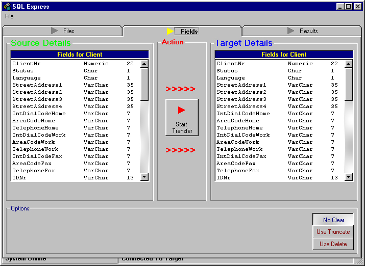



## SQL Table Copy \( via RDO\)  from one ODBC Connection to Another\.

### Description

Uses RDO to connect to 2 different (or the same) ODBC specified connections. Allows you to select tables on both sides and creates SQL statements to transfer the Data from the Source Table to the Target Table. Has the Option to Clear or Truncate the Target Table before Transfer. The 2 Tables must have the same amount of fields (of course).It automatically does the single quote thing for the fields that requires it. Easy to convert to ADO. Very nice , easy to use interface. The ODBC connection wil NOT work on NT , although minor changes can easily make this happen. Comments are very Welcome , even from critics.
 
### More Info
 

             |
---                |---
**Submitted On**   |2000-07-03 09:56:54
**By**             |[N/A](https://github.com/Planet-Source-Code/PSCIndex/blob/master/ByAuthor/empty.md)
**Level**          |Advanced
**User Rating**    |5.0 (15 globes from 3 users)
**Compatibility**  |VB 3\.0, VB 4\.0 \(16\-bit\), VB 4\.0 \(32\-bit\), VB 5\.0, VB 6\.0, VB Script, ASP \(Active Server Pages\) 
**Category**       |[Databases/ Data Access/ DAO/ ADO](https://github.com/Planet-Source-Code/PSCIndex/blob/master/ByCategory/databases-data-access-dao-ado__1-6.md)
**World**          |[Visual Basic](https://github.com/Planet-Source-Code/PSCIndex/blob/master/ByWorld/visual-basic.md)
**Archive File**   |[CODE\_UPLOAD7388732000\.zip](https://github.com/Planet-Source-Code/sql-table-copy-via-rdo-from-one-odbc-connection-to-another__1-9468/archive/master.zip)

